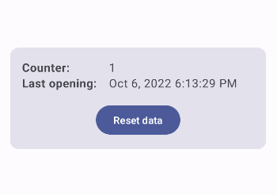

# Tutorial - "How To Use Android’s Proto DataStore With Kotlin Support"

This is the GitHub repository with code samples from my article ["How To Use Android’s Proto DataStore With Kotlin Support"](https://medium.com/tech-takeaways/how-to-use-androids-proto-datastore-with-kotlin-support-8e4f80f1d6d).

Because I feel like the setup process for using the [Proto DataStore](https://developer.android.com/topic/libraries/architecture/datastore#proto-datastore) is quite complicated, 
I decided to not only write an article but also provide a sample repository.

## What this app is about
It's a showcase app that can guide you how to setup and use the Proto DataStore with Kotlin support. 

On app start, the `AppStartupParams` will automatically be updated. 

The UI shows the app opening counter and the last time the counter got updated.

If you click on "Reset data" the `AppStartupParams` will be reset to the default.

The app has no real purpose and should only serve as an example for the setup process. 
